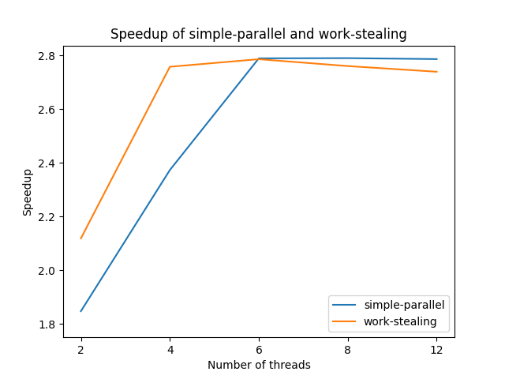

# Performance Analysis

## Problem Description
The use of Large Language Models (LLMs) to answer user queries has become widespread, finding applications in various domains like chatbots and customer service. With millions of users interacting simultaneously, the ability to handle numerous requests efficiently is critical for improving user experience and satisfaction.

This project explores the development of a conversational AI chatbot using parallel processing to enhance system performance when responding to user prompts. The program is written in Go and employs an advanced LLM model, LLama 3.2, to generate responses. The aim is to simulate a real-world scenario where millions of concurrent user requests are processed. Sequential processing would lead to delays, negatively impacting user satisfaction, making parallelism an essential technique for optimization.

The project implements two versions of parallelism:

1. **Basic Parallel Implementation (Simple Parallel)**  
   A fixed number of threads process the workload by evenly dividing the total number of tasks. While this approach ensures balanced task allocation, it may lead to inefficiencies in scenarios where task durations vary significantly.

2. **Work-Stealing Parallelism**  
   To address the inefficiencies of basic parallelism, a work-stealing algorithm is introduced. In this model, idle threads dynamically "steal" tasks from busy threads to maximize resource utilization and minimize the overall runtime.

To reduce complexity and focus on parallelism, the system uses predefined inputs instead of real-time request-response interfaces. The inputs include 30 structured prompts requesting the generation of a specific number of sentences (ranging from 1 to 30) about the University of Chicago. These prompts are intentionally ordered to ensure some threads complete their tasks earlier than others, showcasing the benefits of the work-stealing implementation.

To ensure consistent benchmarking, the model’s temperature is set to 0, making the outputs deterministic.

---

## How to run benchmark on your local machine
To run the benchmark on your local machine, follow these steps:

1. Clone the repository and navigate to the project directory:
    ```bash
    git clone https://github.com/yourusername/parallel-llm.git
    cd parallel-llm-requests/
    ```

2. Install the necessary dependencies:
    ```bash
    source install/go-install.sh
    source install/ollama-install.sh
    ```

3. Run the benchmark script:
    ```bash
    source benchmark/run.sh
    ```

> **Note:** When running benchmarks, change `RUNMODE` in `main.go` to `PROD` to avoid writing output to a file and speed up the process.

---

## Results and Discussion

### Speedup Graph Analysis
The speedup graph compares the performance of the simple-parallel implementation (blue line) and the work-stealing implementation (orange line) with varying numbers of threads.



#### 1. Simple-Parallel
- Initially, the simple-parallel implementation shows steady performance improvement as the number of threads increases from 2 to 6. This is due to more threads concurrently processing tasks, reducing overall runtime.
- However, the speedup starts to plateau at higher thread counts (beyond 6). This is likely because tasks are evenly divided among threads at the beginning, and no dynamic load balancing is applied. If certain threads complete their tasks early, they remain idle while other threads continue working, limiting further improvements.

#### 2. Work-Stealing
- The work-stealing implementation exhibits a steeper performance improvement for lower thread counts (2–6). This is because idle threads dynamically "steal" tasks from busy threads, ensuring balanced workload distribution and minimizing idle time.
- Beyond 6 threads, the performance also begins to plateau, though at a slightly higher speedup compared to simple-parallel. The plateau occurs due to implementation overhead, such as the expensive atomic compare-and-swap operations required for task stealing. As more threads compete for access to the shared queue when stealing, contention and synchronization overhead reduce the efficiency of the algorithm.

#### 3. Overall Comparison
- Both implementations achieve a successful parallelization of the workload, as evidenced by the increase in speedup relative to the sequential version.
- The work-stealing implementation consistently outperforms simple-parallel due to its ability to redistribute tasks dynamically. The intentional ordering of input tasks further amplifies this advantage by simulating scenarios where threads finish their tasks unevenly.

### Challenges Faced in Implementation
1. **Task Granularity and Load Balancing**
   - In the simple-parallel implementation, tasks are statically assigned to threads at the start. This made it difficult to address imbalances when certain threads completed their tasks earlier than others.
   - Implementing work-stealing introduced complexity in task management, as the system required a lock-free queue to facilitate dynamic task redistribution.

2. **API Call Latency**
   - The reliance on the Ollama LLM API introduced a bottleneck, as each thread needed to wait for the model's response. This external dependency introduced uncontrollable latency variations, making it challenging to achieve ideal speedup.

3. **Memory Overhead**
   - Creating a new LLM agent for each thread required significant memory allocation. This resource-intensive step could have limited the scalability of the program, especially with higher thread counts.

### Hotspots and Bottlenecks
1. **Hotspots (Parallelizable Sections)**
   - Prompt Processing: The task of generating responses for individual prompts is inherently parallelizable, as each prompt is independent of the others. Both simple-parallel and work-stealing implementations successfully parallelized this portion.

2. **Bottlenecks (Sequential Sections)**
   - Queue Management: In the work-stealing implementation, the shared queue becomes a bottleneck as threads compete to dequeue tasks when stealing. The use of atomic compare-and-swap operations introduces additional overhead.
   - API Response Time: The system's reliance on the LLM API meant that all threads had to wait for the model's response, which cannot be parallelized or controlled.

### Comparison of Parallel Implementations
1. **Performance**
   - The work-stealing implementation achieved higher speedups compared to simple-parallel due to its ability to dynamically redistribute tasks. This was particularly effective for workloads with uneven task durations, as seen in the intentionally ordered prompts in inputs.txt.

2. **Overhead**
   - The work-stealing implementation incurred additional overhead due to its use of a lock-free queue and atomic operations. While this overhead was manageable for lower thread counts, it became more pronounced as the number of threads increased, contributing to the performance plateau.
   - In contrast, the simple-parallel implementation had minimal overhead but suffered from inefficiencies due to idle threads.

3. **Scalability**
   - Both implementations demonstrated limited scalability at higher thread counts, primarily due to API call latency and memory overhead.

### Factors Limiting Speedup
1. **Lack of Parallelism on LLM API calls**
   - The program's design ensured that all computationally intensive sections (prompt processing) were parallelized. However, the dependency on sequential API calls limited further gains.

2. **Synchronization Overhead**
   - In the work-stealing implementation, synchronization overhead from the lock-free queue reduced efficiency at higher thread counts.

3. **External Dependencies**
   - The system's reliance on the Ollama LLM API introduced unpredictable delays, as external factors like network latency and server load could affect response times.

---

In conclusion, this project demonstrated the successful implementation of two parallel processing algorithms for conversational AI workloads. While both achieved significant speedups over the sequential version, the work-stealing implementation showcased superior performance due to dynamic load balancing. However, external dependencies and synchronization overheads highlighted the challenges of achieving ideal scalability, providing valuable insights for future optimization efforts.
